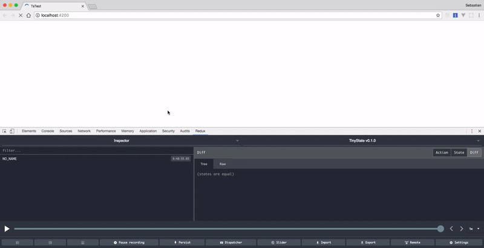

<div align="center">
  <br />
  A tiny, yet powerful state management library for Angular inspired by <a href="https://github.com/jamiebuilds/unstated">Unstated</a>.<br />
  Created by <a href="https://twitter.com/Sebholstein">@Sebholstein</a>
</div>

---

[](https://travis-ci.org/SebastianM/tinystate) [](https://codecov.io/gh/SebastianM/tinystate) [](https://www.npmjs.com/package/@tinystate/core)  

---

## Introduction

State management in every component-based application is hard. TinyState tries to solve the following problem:  

> Sharing state between components as simple as possible and leverage the good parts of component state and Angular`s dependency injection system.

## Demo

Demo on [Stackblitz.io](https://stackblitz.com/edit/tinystate-demo)

## Installation

```bash
yarn add @tinystate/core
# or
npm install @tinystate/core
```

### Loading the module in the app/root module

```typescript
import { TinyStateModule } from '@tinystate/core';

@NgModule({
  imports: [
    CommonModule,
    TinyStateModule.forRoot()
  ]
})
class AppModule {}
```

## Example

```typescript
import { Container } from '@tinystate/core';

export interface CounterState {
  count: number;
}

/**
 * A Container is a very simple class that holds your state and some logic for updating it.
 * The shape of the state is described via an interface (in this example: CounterState).
 */
export class CounterContainer extends Container<CounterState> {
  getInitialState(): CounterState {
    return {
      count: 0
    };
  }

  increment(increment: number) {
    this.setState(state => ({ count: state.count + increment }));
  }

  decrement(decrement: number = 1) {
    this.setState(state => ({ count: state.count - decrement }));
  }
}

@Component({
  selector: 'my-component',
  template: `
    <h1>
      Counter: {{ counter$ | async }}
    </h1>
    <button (click)="increment()">Increment</button>
    <button (click)="decrement()">Decrement</button>
  `,
  providers: [
    CounterContainer
  ]
})
export class MyComponent {
  counter$: Observable<number> = this.counterContainer.select(state => state.count);

  constructor(private counterContainer: CounterContainer) {}

  increment() {
    this.counterContainer.increment(1);
  }

  decrement() {
    this.counterContainer.decrement();
  }
}
```

## Global state

The example shown above creates a `CounterContainer` instance for the `MyComponent` and is also injectable for all **child** components of the `MyComponent`.

If you have global state that should be injectable in all your components, add the `providedIn: 'root'` option to the `@Injectable` decorator of the Container:

```typescript
@Injectable({
  providedIn: 'root'
})
class CounterContainer {}
```

With the configuration show above, you can inject the `CounterContainer` container in every component of your application.

## Testing containers

Testing containers is really easy. Let's say we want to write a test for the following container:

```typescript
import { Container } from '@tinystate/core';

export interface CounterState {
  count: number;
}

export class CounterContainer extends Container<CounterState> {
  getInitialState(): CounterState {
    return {
      count: 0
    };
  }

  increment() {
    this.setState(state => ({ count: state.count + 1 }));
  }
}
```

Here's an example of a possible test with Jasmine:

```typescript
import { CounterContainer } from './counter.container';
import { TestBed, inject } from '@angular/core/testing';

describe('CounterContainer', () => {
  beforeEach(() => {
    TestBed.configureTestingModule({
      providers: [CounterContainer]
    });
  });

  it(
    'should have an initial count state of 0',
    inject([CounterContainer], (container: CounterContainer) => {
      let count: number | undefined;
      container.select(s => s.count).subscribe(s => (count = s));
      expect(count).toEqual(0);
    })
  );

  it(
    'should increment the count by one when calling increment',
    inject([CounterContainer], (container: CounterContainer) => {
      let count: number | undefined;
      container.select(s => s.count).subscribe(s => (count = s));
      container.increment();
      expect(count).toEqual(1);
    })
  );
});
```

## Testing components that use containers

Let's write a test for the following component:

```typescript
@Component({
  selector: 'my-component',
  changeDetection: ChangeDetectionStrategy.OnPush,
  template: `
    <div class="count">{{ count$ | async }}</div>
    <button class="inc-count" (click)="increment()">inc</button>
  `
})
class MyComponent {
  count$: Observable<number> = this.counterContainer.select(s => s.count);

  constructor(private counterContainer: CounterContainer) {}

  increment() {
    this.counterContainer.increment();
  }
}
```

```typescript
describe('MyComponent', () => {
  let counterContainer: CounterContainer;

  beforeEach(
    async(() => {
      counterContainer = jasmine.createSpyObj<CounterContainer>('CounterContainer', [
        'increment',
        'select'
      ]);
      return TestBed.configureTestingModule({
        declarations: [MyComponent],
        providers: [{ provide: CounterContainer, useValue: counterContainer }]
      }).compileComponents();
    })
  );

  it('should increment via the counter', () => {
    const fixture = TestBed.createComponent(MyComponent);
    fixture.debugElement.query(By.css('.inc-count')).triggerEventHandler('click', null);
    expect(counterContainer.increment).toHaveBeenCalledTimes(1);
  });
});
```

## Redux Devtools Support

To enable support for the Redux Devtools Extension, add the following module to your root NgModule:

```typescript
import { TinyStateModule, ReduxDevtoolsPluginModule } from '@tinystate/core';

@NgModule({
  imports: [
    CommonModule,
    TinyStateModule.forRoot(),
    ReduxDevtoolsPluginModule.forRoot()
  ],
  providers: [
    CounterContainer
  ]
})
class AppModule {}
```

TinyState hasn't the concept of Actions. So the action name will always be `NO_NAME`. But you will see how the state of all your containers change, which is even without action names useful for debugging:



## FAQ

### When should I use TinyState?

Do you have a global state or a state that is needed in several components that you want to share between them and think that solutions like NGRX or Redux are a way too heavy for your simple use case? - then TinyState could be for you.

TinyState is not a solution that should be seen as an alternative to NGRX or Redux because these projects are trying to solve different problems than TinyState wants to solve.

IMO local component state is totally fine as long as it works for you. So choose the right tool for the right job.

### Can I use the action/reducer pattern with TinyState?

Nope. The goal of this project is to keep sharing state between components simple. If you think your state is too complex/big or you want a replayable, fully predictable state container, you should consider using [NGRX](https://github.com/ngrx/platform), [NGXS](https://github.com/amcdnl/ngxs) or [Redux](https://github.com/reactjs/redux).

### What are the differences between TinyState and [Unstated](https://github.com/jamiebuilds/unstated)?

* Unstated supports React - TinyState supports Angular.
* TinyState uses RxJS as the base for all the state handling whereas Unstated uses plain objects. RxJS plays very well together with Angular and allows powerful streaming transformations.
* Unstated uses the React Context API and a self-implemented Injection pattern whereas TinyState uses Angular's built-in [ Hierarchical Dependency Injectors](https://angular.io/guide/hierarchical-dependency-injection) to create/assign Container instances to component hierarchies.
* TinyState supports Redux Devtools and has a plugin API.
